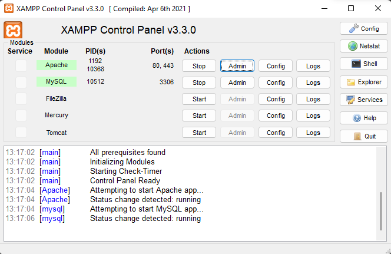
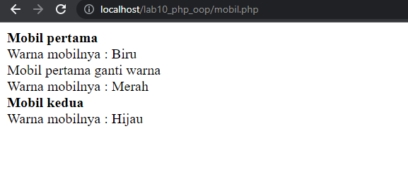
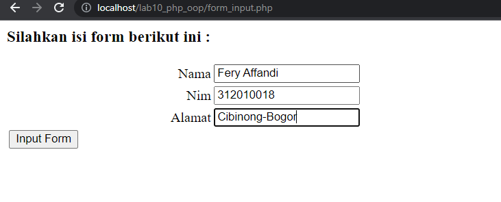

# lab10_php_oop

**Nama : Fery Affandi** <br>
**NIM : 312010018** <br>

### Untuk melihat kembali lab9_php_modular klik <a href="https://github.com/Vinez1/lab9_php_modular.git">disini </a>

## Langkah-langkah Praktikum

### Nyalakan aplikasi Xampp



### Buat file baru dengan nama <b>mobil.php</b>

```php
<?php
/**
* Program sederhana pendefinisian class dan pemanggilan class.
**/

class Mobil
{
    private $warna;
    private $merk;
    private $harga;

    public function __construct()
    {
        $this->warna = "Biru";
        $this->merk = "BMW";
        $this->harga = "10000000";
    }

    public function gantiWarna ($warnaBaru)
    {
        $this->warna = $warnaBaru;
    }

    public function tampilWarna ()
    {
        echo "Warna mobilnya : " . $this->warna;
    }
}

// membuat objek mobil
$a = new Mobil();
$b = new Mobil();

// memanggil objek
echo "<b>Mobil pertama</b><br>";
$a->tampilWarna();
echo "<br>Mobil pertama ganti warna<br>";
$a->gantiWarna("Merah");
$a->tampilWarna();

// memanggil objek
echo "<br><b>Mobil kedua</b><br>";
$b->gantiWarna("Hijau");
$b->tampilWarna();
?>
```
Outputnya <br>



### Buat file baru dengan nama <b>form.php</b>

```php
<?php
/**
* Nama Class: Form
* Deskripsi: CLass untuk membuat form inputan text sederhana
**/

class Form
{
    private $fields = array();
    private $action;
    private $submit = "Submit Form";
    private $jumField = 0;
    public function __construct($action, $submit)
    {
        $this->action = $action;
        $this->submit = $submit;
    }

    public function displayForm()
    {
    echo "<form action='".$this->action."' method='POST'>";
    echo '<table width="100%" border="0">';
    for ($j=0; $j<count($this->fields); $j++) {
        echo "<tr><td
    align='right'>".$this->fields[$j]['label']."</td>";
        echo "<td><input type='text'
    name='".$this->fields[$j]['name']."'></td></tr>";
    }
    echo "<tr><td colspan='2'>";
    echo "<input type='submit' value='".$this->submit."'></td></tr>";
    echo "</table>";
    }

    public function addField($name, $label)
    {
        $this->fields [$this->jumField]['name'] = $name;
        $this->fields [$this->jumField]['label'] = $label;
        $this->jumField ++;
    }
}
?>
```
outputnya 

